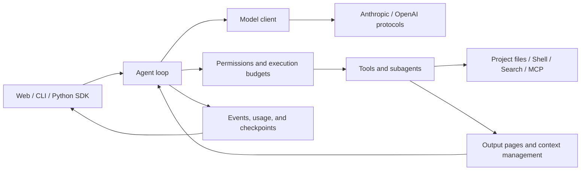

<h1 align="center">CodeWeft</h1>

<p align="center"><a href="README.md">简体中文</a> · <strong>English</strong></p>

<p align="center"><strong>An AI coding workbench for understanding, editing, and verifying code in your local projects.</strong></p>

<p align="center">Web workbench · Command line · Python SDK</p>

<p align="center">
  
  
  
</p>

<p align="center">
  <a href="#quick-start">Quick start</a> ·
  <a href="#features">Features</a> ·
  <a href="#how-it-works">How it works</a> ·
  <a href="#documentation">Documentation</a> ·
  <a href="#development-and-validation">Development and validation</a>
</p>

CodeWeft connects model APIs, code search, file editing, command execution, and task management into a coding workflow. Describe a task in your browser or terminal, let the agent find the relevant implementation, edit files, and run checks, and follow its tool calls, task progress, token usage, and file changes.

The agent runtime is built in Python, with a local React + TypeScript web workbench. Model protocols, tools, permissions, context management, and collaboration are organized as separate components, making the project useful both for everyday development and for studying or extending coding agent runtimes.

**Why CodeWeft?** A weft connects the threads of a fabric. CodeWeft connects models, tools, and collaborating agents to take local coding tasks from understanding to verified changes. The Python package and commands remain `codeagent`, preserving existing configuration and data directories.

## Features

| Capability | What it provides |
| --- | --- |
| **Visible execution** | Follow streaming responses, tool execution, tasks, subagents, file changes, and model usage in the web UI. Conversations and run records persist in SQLite. |
| **Multiple model protocols** | Use Anthropic Messages, OpenAI Chat Completions, or Responses. Configure conversation, speech recognition, and embedding services separately in model settings. |
| **Code understanding and retrieval** | Combine keywords, code structure, and optional vector retrieval to find implementations, with file paths, symbols, and source excerpts. Structured retrieval supports languages including Python, Java, JavaScript, and TypeScript. |
| **Project overview and batch reading** | `repo_map` shows directories, file sizes, and likely entry points, tests, and configuration. `read_file` accepts up to five `file_paths`, preserving separate line numbers and continuation cursors. |
| **Context management for longer tasks** | Check requests against model context windows and summarize history in chunks. Large tool results have bounded pages, archives, and follow-up reading tools. |
| **Tasks and parallel collaboration** | Persistent tasks track dependencies and status. Ordinary agents can run parallel reads and delegate read-only subtasks; Teams can develop in separate Git worktrees. |
| **Extensible tools** | Load instructions on demand through Skills, retain project conventions in long-term memory, connect MCP tools, and optionally enable Tavily web search. |
| **Attachments** | Attach files through the web UI or CLI. Image, PDF, text, and audio handling depends on the selected protocol and configured model capabilities. |

## Quick start

You need **Python 3.11+ and Git**. The web workbench also requires **Node.js 22+ and npm**. Model calls use your own provider endpoint, model ID, and API key.

### 1. Clone and install

```bash
git clone https://github.com/jerry021211/Coding-Agent.git
cd Coding-Agent
python -m venv .venv
```

Activate the virtual environment and install:

```powershell
# Windows PowerShell
.\.venv\Scripts\Activate.ps1
python -m pip install -e ".[web]"
```

<details>
<summary>macOS / Linux</summary>

```bash
source .venv/bin/activate
python -m pip install -e ".[web]"
```

</details>

### 2. Build and start the web workbench

From the repository root:

```powershell
cd web
npm.cmd ci
npm.cmd run build
cd ..
python -m codeagent.web.cli --workspace . --port 8765
```

On macOS / Linux, use `npm` instead of `npm.cmd`. Open [http://127.0.0.1:8765](http://127.0.0.1:8765), select **Model settings** (模型设置) at the bottom of the left sidebar, choose a protocol, and save your model configuration. You can configure the model through the UI on first launch without creating a `.env` file.

When creating a conversation, select the local project directory you want to work on. For example, enable **Read-only protection** (只读保护) below the input box and ask:

> Map this project's entry points, main modules, and test commands. Include the key file paths.

When you want to make changes, turn off read-only protection and provide a specific task:

> Fix the exception this endpoint raises on empty input, add a regression test, and report the validation results.

### 3. Use the CLI

For CLI-only use, install the core package with `python -m pip install -e .`; no frontend build is needed. The following example uses an OpenAI Chat Completions-compatible service. Create `.env` in the directory where you launch the CLI and replace the placeholders with your provider's settings:

```dotenv
MODEL_PROTOCOL=openai_chat
MODEL_ID=your-model-id
API_KEY=your-api-key
BASE_URL=https://your-provider.example/v1
STREAMING=true
```

The CLI uses the **current directory** as its workspace. Run these commands from your target project:

```bash
codeagent --read-only "Explain this project's architecture and test entry points"
codeagent "Fix the issue and run the relevant tests"
codeagent
```

Running without a prompt starts an interactive session. See [Model services](docs/model-services.md) for other protocols, attachments, reasoning options, and configuration precedence, and [.env.example](.env.example) for environment variables. Model settings saved through the web UI take precedence over the corresponding environment variables. The detailed guides are currently in Chinese.

## How it works

The core loop follows “model request → tool execution → result feedback.” Permissions, budgets, memory, and collaboration extend this loop.



| Entry point | Responsibility |
| --- | --- |
| [`codeagent/agent.py`](codeagent/agent.py) | Agent loop, tool results, and subagent coordination |
| [`codeagent/providers.py`](codeagent/providers.py) / [`anthropic_client.py`](codeagent/anthropic_client.py) | Model protocol adapters and streaming calls |
| [`codeagent/tools/`](codeagent/tools) / [`code_search/`](codeagent/code_search) | Files, commands, retrieval, and tool registration |
| [`codeagent/context/`](codeagent/context) | Request budgets, summaries, archives, and read references |
| [`codeagent/runtime/`](codeagent/runtime) / [`teams/`](codeagent/teams) / [`worktrees/`](codeagent/worktrees) | Execution scheduling, collaboration, and Git workspace isolation |
| [`codeagent/web/`](codeagent/web) / [`web/src/`](web/src) | FastAPI, SQLite, SSE, and the React interface |

See the [Usage guide](docs/usage-guide.md) for a fuller module overview and SDK examples.

## Scope and boundaries

### Read-only permissions

Read-only protection blocks file and memory writes, task updates, delegation, unknown tools, and external MCP calls. Shell access is limited to supported read-only commands. This is a tool execution policy, **not an operating system sandbox**. See [Read-only permissions](docs/usage-guide.md#只读权限) for details.

### Local runtime and data

The web server listens only on localhost and is intended for local, single-user use. Conversations, checkpoints, archives, and indexes are stored outside the repository by default; set `CODEAGENT_DATA_DIR` to choose a different location. Requests to remote models, embedding providers, web search, or MCP services are sent to the configured services.

### Multiple agents and recovery

Ordinary conversations can run concurrently, but conversations operating on the same directory still share its files. Teams are disabled by default and require approval of a team plan when enabled. New Teams support candidate validation, internal integration, and local delivery; they **do not automatically push to GitHub**. See [Team integration and delivery](docs/team-managed-integration.md) for workspace and recovery behavior.

Each logical execution of an ordinary agent is limited to 200 rounds, with a wrap-up reminder starting at round 185. Unfinished ordinary runs are marked as interrupted after a restart; operations are not replayed automatically. See [Execution budgets](docs/loop-guard.md) for round limits, cancellation, loop detection, and other budgets.

## Documentation

The following detailed guides are currently available in Chinese.

| Topic | Guide |
| --- | --- |
| Full usage, SDK, permissions, Skills, and MCP | [Usage guide](docs/usage-guide.md) |
| Model configuration, protocol differences, and attachments | [Model services](docs/model-services.md) |
| Code search, indexing, and optional vector retrieval | [Code retrieval](docs/code-search.md) |
| Output pages, source archives, and summary limits | [Tool output policy](docs/tool-output-policy.md) |
| Read-only subagents and parallel reads | [Ordinary agent parallelism](docs/parallel-execution.md) |
| Conversation queues and run isolation | [Concurrent sessions](docs/concurrent-sessions.md) |
| Long-term memory storage and retrieval | [Memory](docs/memory-retrieval.md) |
| Team planning, collaboration, and local delivery | [Collaboration boundaries](docs/team-collaboration-boundaries.md) · [Managed integration](docs/team-managed-integration.md) |
| Loop detection, retries, and execution stops | [Execution budgets](docs/loop-guard.md) |
| Evaluation methods and reproduction | [Evaluation tools](evals/README.md) · [Code retrieval evaluation](docs/code-retrieval-evaluation.md) |

## Development and validation

Run backend tests from the repository root:

```bash
python -m unittest discover -s tests
```

Run frontend tests and build for production:

```powershell
cd web
npm.cmd test
npm.cmd run build
```

For frontend development, open a second terminal in `web` and run `npm.cmd run dev`. Vite proxies `/api` requests to localhost port `8765`. Use `npm` on macOS / Linux.

Reproducible bug reports and improvement suggestions are welcome through [Issues](https://github.com/jerry021211/Coding-Agent/issues). When submitting changes, describe the problem, resulting behavior, and validation performed. Keep API keys, runtime data, and private evaluation artifacts out of commits.

## Acknowledgments

The project draws on [shareAI-lab/learn-claude-code](https://github.com/shareAI-lab/learn-claude-code) and its approach to separating the agent loop from tools, permissions, memory, and other capabilities. CodeWeft builds on these ideas with a local web workbench, context management, code retrieval, and multi-agent collaboration.
