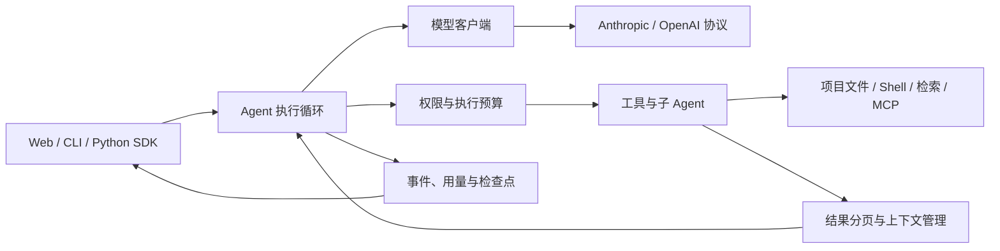

<h1 align="center">CodeAgent</h1>

<p align="center"><strong>在本地项目中理解代码、执行修改、验证结果的 AI 编程工作台。</strong></p>

<p align="center">Web 工作台 · 命令行 · Python SDK</p>

<p align="center">
  
  
  
</p>

<p align="center">
  <a href="#快速开始">快速开始</a> ·
  <a href="#核心能力">核心能力</a> ·
  <a href="#工作原理">工作原理</a> ·
  <a href="#文档导航">文档导航</a> ·
  <a href="#开发与验证">开发与验证</a>
</p>

CodeAgent 将模型接入、代码检索、文件编辑、命令执行和任务管理连接成完整的编程流程。你可以在浏览器或终端中提出需求，让 Agent 在指定项目里查找实现、修改文件并运行验证，同时查看工具调用、任务进度、Token 用量和文件变化。

项目以 Python 实现 Agent 运行时，以 React + TypeScript 提供本机 Web 工作台。模型协议、工具、权限、上下文和协作能力独立组织，适合日常项目开发，也适合学习和扩展 Coding Agent 的执行机制。

## 核心能力

| 能力 | 在项目中如何使用 |
| --- | --- |
| **可观察的编程过程** | Web 展示流式回复、工具执行、任务、子 Agent、文件改动和模型用量；会话与运行记录持久化到 SQLite。 |
| **多协议模型接入** | 支持 Anthropic Messages、OpenAI Chat Completions 和 Responses；可在模型设置页分别配置对话、语音识别和向量服务。 |
| **代码理解与检索** | 结合关键词、代码结构与可选向量检索定位实现，返回路径、符号和源码片段；支持 Python、Java、JavaScript、TypeScript 等语言的结构化检索。 |
| **长任务上下文管理** | 按模型窗口检查请求预算，对历史进行分块摘要；大型工具结果提供有界页面、归档和后续读取入口。 |
| **任务与并行协作** | 持久化任务支持依赖与状态管理；普通 Agent 可并行读取、委派只读子任务，Team 可通过独立 Git worktree 协作开发。 |
| **可扩展工具能力** | 通过 Skills 按需加载说明，使用长期记忆保存项目约定，接入 MCP 工具；可选启用 Tavily 联网搜索。 |
| **附件输入** | Web 和 CLI 支持附件；图片、PDF、文本与音频的处理方式取决于模型协议和已配置的输入能力。 |

## 快速开始

准备 **Python 3.11+、Git**；使用 Web 工作台还需要 **Node.js 22+ 和 npm**。模型调用需要你自己的服务地址、模型名称和密钥。

### 1. 获取代码并安装

```bash
git clone https://github.com/jerry021211/Coding-Agent.git
cd Coding-Agent
python -m venv .venv
```

激活虚拟环境后安装：

```powershell
# Windows PowerShell
.\.venv\Scripts\Activate.ps1
python -m pip install -e ".[web]"
```

<details>
<summary>macOS / Linux</summary>

```bash
source .venv/bin/activate
python -m pip install -e ".[web]"
```

</details>

### 2. 构建并启动 Web 工作台

在仓库根目录执行：

```powershell
cd web
npm.cmd ci
npm.cmd run build
cd ..
python -m codeagent.web.cli --workspace . --port 8765
```

macOS / Linux 将 `npm.cmd` 换成 `npm`。打开 [http://127.0.0.1:8765](http://127.0.0.1:8765)，从左侧底部进入 **模型设置**，选择协议并填写模型信息，保存后即可创建会话。首次启动可以不配置 `.env`。

新建会话时选择要操作的本机项目目录。例如，先开启输入框下方的 **只读保护**，发送：

> 梳理这个项目的入口、主要模块和测试方式，给出关键文件路径。

需要修改时关闭只读保护，再发送具体任务：

> 修复这个接口在空输入时的异常，补充对应测试，并说明验证结果。

### 3. 使用命令行

只使用 CLI 时，无需构建前端，安装核心包 `python -m pip install -e .` 即可。下面以 OpenAI Chat Completions 兼容服务为例，在启动目录创建 `.env`，将占位值替换为实际配置：

```dotenv
MODEL_PROTOCOL=openai_chat
MODEL_ID=your-model-id
API_KEY=your-api-key
BASE_URL=https://your-provider.example/v1
STREAMING=true
```

CLI 以**当前目录**作为工作区。在目标项目目录中运行：

```bash
codeagent --read-only "解释这个项目的架构和测试入口"
codeagent "修复问题并运行相关测试"
codeagent
```

不传提示词会进入交互会话。其他协议、附件、推理参数及配置优先级见 [模型服务配置](docs/model-services.md)；完整环境变量参考 [.env.example](.env.example)。Web 中已保存的模型设置会优先于对应环境变量生效。

## 工作原理

核心循环围绕“模型请求 → 工具执行 → 结果回传”运行，权限、预算、记忆与协作机制围绕这个循环扩展。



| 代码入口 | 职责 |
| --- | --- |
| [`codeagent/agent.py`](codeagent/agent.py) | Agent 主循环、工具结果回传与子 Agent 协调 |
| [`codeagent/providers.py`](codeagent/providers.py) / [`anthropic_client.py`](codeagent/anthropic_client.py) | 模型协议适配与流式调用 |
| [`codeagent/tools/`](codeagent/tools) / [`code_search/`](codeagent/code_search) | 文件、命令、搜索与工具注册 |
| [`codeagent/context/`](codeagent/context) | 请求预算、摘要、归档与读取引用 |
| [`codeagent/runtime/`](codeagent/runtime) / [`teams/`](codeagent/teams) / [`worktrees/`](codeagent/worktrees) | 执行调度、协作与 Git 工作区隔离 |
| [`codeagent/web/`](codeagent/web) / [`web/src/`](web/src) | FastAPI、SQLite、SSE 与 React 界面 |

更完整的模块说明和 SDK 示例见 [使用指南](docs/usage-guide.md)。

## 使用边界

### 只读权限

只读保护会阻止文件和记忆写入、任务更新、委派、未知工具与外部 MCP 调用；Shell 仅允许受支持的只读命令。它是工具执行策略，**不是操作系统沙箱**。详细行为见 [只读权限说明](docs/usage-guide.md#只读权限)。

### 本地运行与数据

Web 服务仅监听本机，面向本地单用户使用。会话、检查点、归档和索引默认保存到仓库外的运行时目录，可用 `CODEAGENT_DATA_DIR` 指定位置。连接远程模型、向量服务、联网搜索或 MCP 时，相应请求会发送到所配置的服务。

### 多 Agent 与恢复

普通会话可以并发运行，但操作同一个目录时仍共享项目文件。Team 默认关闭，启用后需要批准团队方案；新 Team 默认支持候选验证、内部集成和本地交付，**不会自动推送到 GitHub**。查看 [Team 集成与交付](docs/team-managed-integration.md) 了解工作区及恢复边界。

普通 Agent 的每次逻辑执行最多 200 轮，第 185 轮开始提醒收尾。重启后未完成的普通运行会标记为中断，不自动重放操作；固定轮数、取消、循环检测和其他预算的关系见 [执行预算](docs/loop-guard.md)。

## 文档导航

| 想了解什么 | 文档 |
| --- | --- |
| 完整用法、SDK、权限、Skills 与 MCP | [使用指南](docs/usage-guide.md) |
| 模型配置、协议差异与附件 | [模型服务](docs/model-services.md) |
| 代码搜索、索引与可选向量检索 | [代码检索](docs/code-search.md) |
| 结果分页、原文归档与摘要限制 | [工具输出策略](docs/tool-output-policy.md) |
| 只读子 Agent 与读取并行 | [普通 Agent 并行](docs/parallel-execution.md) |
| 多会话队列与运行隔离 | [多会话并发](docs/concurrent-sessions.md) |
| 长期记忆的存储与召回 | [记忆机制](docs/memory-retrieval.md) |
| Team 方案、协作与本地交付 | [协作边界](docs/team-collaboration-boundaries.md) · [自动集成](docs/team-managed-integration.md) |
| 防循环、重试与执行停止 | [执行预算](docs/loop-guard.md) |
| 评测方法与复现入口 | [评测工具](evals/README.md) · [代码检索评测](docs/code-retrieval-evaluation.md) |

## 开发与验证

后端测试在仓库根目录执行：

```bash
python -m unittest discover -s tests
```

前端测试与生产构建：

```powershell
cd web
npm.cmd test
npm.cmd run build
```

开发界面时，在另一个终端进入 `web` 目录，运行 `npm.cmd run dev`；Vite 会将 `/api` 请求代理到本机 `8765` 端口。macOS / Linux 使用 `npm`。

欢迎通过 [Issues](https://github.com/jerry021211/Coding-Agent/issues) 提交可复现的问题或改进建议。提交修改时请说明问题、改动行为和验证结果，避免提交密钥、运行时数据或评测产生的私有内容。

## 致谢

项目设计参考了 [shareAI-lab/learn-claude-code](https://github.com/shareAI-lab/learn-claude-code) 将 Agent loop 与工具、权限、记忆等能力分层组织的思路，并在此基础上实现本地 Web 工作台、上下文管理、代码检索与多 Agent 协作。
