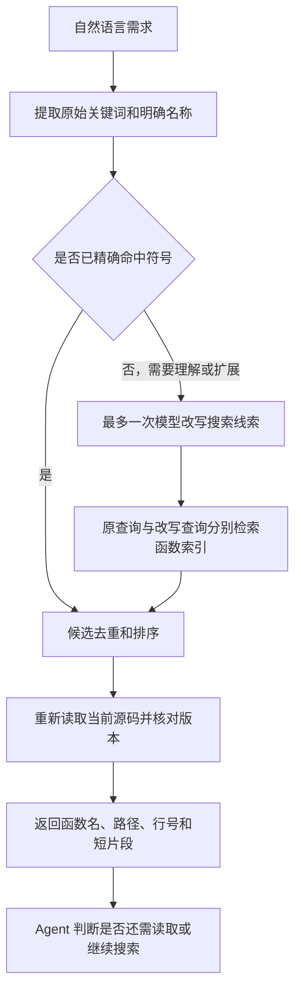

# 按需求找代码：调研与改造方案

日期：2026-09-29。状态：第一阶段已实施并完成真实 A/B 对比，结果见 [实施报告](code-search-implementation-report-2026-09-29.md)。本文件保留事先制定的目标；实测前五命中持平、首条命中下降，未达到全部目标。

**建议首版新增 `search_code`：把自然语言需求转成可搜索的线索，在本地函数索引中定位，再返回经过源码核对的短片段。** 使用现有模型、Python AST 和 SQLite FTS5；不需要安装 rg，也不需要先部署向量数据库。后续以真实漏检为依据增加向量召回。

目标是让 Agent 少猜关键词、少打开无关文件，并准确给出代码位置。自然语言理解、函数级定位、源码证据是三个分别实现的环节，不能仅加一个索引就宣称已经理解需求。

## 一、先看你已经测出的结果

依据：[原始基线报告](../eval-results/code-retrieval-before/report/report.md)、逐题预测与冻结源码。模型为 `deepseek-v4-flash`，20 道题各运行一次，全部完成，源码校验有效。

| 项目 | 现有结果 | 对改造的含义 |
| --- | --- | --- |
| 严格证据命中 Hit@1 / Hit@5 | 14/16，87.5% | 不应把剩余两题都解释成检索不到 |
| 精确名称题 | 4/4 | 保留精确查找的优势 |
| 自然语言题 | 6/8 | 需要区分定位错误与引用错误 |
| 跨文件找全 | 4/4 | 暂无必要优先搭建完整调用图 |
| 无答案误报 | 0/4 | 新工具不能遇到问题就硬凑结果 |
| 工具调用中位数 | 7.5 次 | 优先减少“搜索—读取—再搜索” |
| 每题累计输入 token 中位数 | 54,393，含缓存 | 关注重复读取与多轮输入，而非只看单次片段大小 |
| 查询耗时中位数 | 11.89 秒 | 用来对比，不能预先承诺提速 |
| 全套空闲价估算费用 | ¥0.45841844 | 查询改写等额外调用也必须算在里面 |

逐题核对发现：

- N04 已选中正确函数，原文片段实际从第 25 行开始，但答案写成第 31 行，因此未通过严格引用校验。
- N08 的正确函数、原文和第 110 行位置都已给出，但引用从 `@staticmethod` 开始。此前评分器用 AST 的 `def` 行作为函数范围起点，没有包含装饰器，因此拒绝了这段合法引用。这是评测器的范围边界问题。
- 仅核对“前五条是否出现正确路径和函数名”的诊断结果是 16/16。**这是补充诊断，不取代原始 14/16 的严格成绩，也不表示复杂项目的任意问题都能找到。**

另有 18 个未标注候选需要复核。因此报告中的 57.78% 返回噪声比例仍属暂定，其中可能有相关调用点，不能直接称作“57.78% 都没用”。

进入实施前，先单独修正评分器的装饰器边界，并复核未标注候选。使用原始预测离线重新评分，不重新调用模型，不覆盖原报告。后续 A/B 使用同一版规则。评测器修正造成的涨分不能计入检索改造收益。

## 二、网上成熟方案中值得借鉴的做法

以下为本次读取的一手资料。表中“采用方式”是针对当前项目的设计判断，并非这些系统承诺本项目会获得相同效果。

| 资料 | 已核实的做法 | 本项目采用方式 |
| --- | --- | --- |
| [Sourcegraph：Cody Context](https://sourcegraph.com/docs/cody/core-concepts/context) | 使用关键词搜索，必要时改写查询，并结合代码关系获取上下文 | 中文需求可转换成英文标识符线索；保留原始词与限制条件 |
| [Aider：Repository map](https://aider.chat/docs/repomap.html) | 提取文件中的重要类、函数和签名，按相关性与 token 预算提供上下文 | 按函数/方法组织代码，控制返回量，避免整文件灌入 |
| [SQLite：FTS5](https://www.sqlite.org/fts5.html) | 提供全文索引、BM25 排序和字段权重 | 用本地 SQLite 保存可重建的函数索引 |
| [Microsoft：Hybrid Search](https://learn.microsoft.com/en-us/azure/search/hybrid-search-overview) | 关键词与向量召回具有不同长处 | 精确符号检索长期保留；语义向量作为可增加的一路 |
| [Microsoft：RRF](https://learn.microsoft.com/en-us/azure/search/hybrid-search-ranking) | 根据各路结果的排名融合，避免直接相加不同尺度的原始分数 | 合并原始查询、改写查询，未来也可接入向量结果 |
| [Python AST](https://docs.python.org/3/library/ast.html)、[Tree-sitter](https://tree-sitter.github.io/tree-sitter/) | 提供源码结构及位置信息；Tree-sitter 支持增量解析 | 首版用标准库处理 Python；以后再接入多语言解析器 |

一个容易误解的点：**按需求检索不等于必须使用向量数据库。** Cody 当前文档就包含查询改写、关键词和代码关系这条路线。向量可以补充词面差异较大的需求，但需要另外验证中文需求到英文代码的效果。

## 三、方案选择

| 方案 | 优点 | 局限 | 取舍 |
| --- | --- | --- | --- |
| 继续让 Agent 自己多次 grep/read | 无新增系统，现有基线已可用 | 容易重复查找，缺少函数级排名与证据打包 | 保留作为后备 |
| 函数索引＋关键词排名＋按需改写 | 可复用现有模型与 SQLite，直接减少文件扫描和定位步骤 | 没有明显名称/注释线索时仍可能漏检 | **首版采用** |
| 词法＋向量混合检索 | 可发现词语不同但语义相近的实现 | 新增 embedding、更新与成本管理；也可能返回看似相似的无关代码 | 有真实漏检证据时加入 |
| 全量代码摘要＋复杂代码图＋模型重排 | 可以支持更复杂的仓库关系与推理 | 建设、更新和调用成本更高 | 暂不作为首版组成 |

首版不预先让模型给每个函数写说明，也不训练检索模型。现有题集的定位已接近饱和，先把调用次数、源码引用和运行维护做好，更容易判断新增能力是否值得保留。

## 四、用户提出需求后，具体怎么找



### 1. 给代码建立函数目录

Python AST 提取函数、异步函数和类方法；按作用域生成完整名称，例如 `ClassName.method_name`。记录路径、函数签名、装饰器起点、定义起点、结束行、注释、标识符及源码哈希。

短函数作为一个检索单元；长函数按语句块建立子片段，仍归属于同一个函数。返回时按函数去重，避免一个长函数占满前五条。模块级常量与导入作为单独的模块片段保存，明确标注类型，不伪装成函数。

源码无法解析时，降级为带行号的文本片段并标记 `parse_fallback`；不能悄悄丢掉正在编辑的文件。首版仅承诺 Python 的函数定位；其他语言保留既有 grep/read 能力。之后使用 Tree-sitter 接入 TypeScript/TSX，再单独建立对应评测。

### 2. 同时搜索名称、路径、注释和代码正文

SQLite FTS5 保存不同字段，初始采用“符号/签名优先，路径与注释其次，正文补充”的权重。BM25 可以理解为“按匹配词的重要程度和匹配程度排序”。具体权重只用调试集校准。

保留完整标识符，同时拆开 `snake_case`、`camelCase` 和路径层级。中文使用预分词/相邻双字片段，复用本项目已有的处理经验。SQLite trigram 对不足三个字符的全文查询有限制，不能指望默认设置自动解决中文短词问题。[FTS5 限制说明](https://www.sqlite.org/fts5.html#the_trigram_tokenizer)

**中文分词只解决文字切分，不会把“停止等待”自动变成英文代码中的取消逻辑。跨语言这一步由下一层完成。**

### 3. 让现有模型把需求改写成搜索线索

已有精确函数名、路径或报错原文时，优先直接搜索。没有精确符号命中，且需求主要为中文并缺少代码标识符，或者首轮词法结果为空时，最多调用现有模型一次，生成至多三组简短关键词；保留用户明确给出的名称、错误码和限制条件。不使用一个未经校准的 BM25 分数当作跨问题通用的“置信度阈值”。

例如调试集中的“等待用户回答时取消，怎样清理等待状态”，可以扩展出 `cancel / wait / pending / cleanup` 等线索。它们只是检索提示，模型不能凭空指定“答案就在某个文件”。不能内置本次正式题的问答对应表或专用关键词映射。

Agent 如果在工具调用时已提供合理关键词，可以直接使用，不再重复请求模型。没有模型可用、改写超时或预算不足时，继续原始查询并标明降级。改写失败不阻塞旧工具。

这条路线仍依赖代码中的名称、字符串、注释与行为线索。如果代码命名晦涩且缺少注释，关键词改写可能不足，这才是后续语义向量要解决的具体问题。

### 4. 合并候选，返回少量真正有用的片段

原始词、精确符号、改写词分别召回；对排名使用 RRF 融合，不直接相加 BM25 和未来的向量分数。精确符号另设优先规则，防止被宽泛查询挤下去。RRF 是合并方法，不会凭空赋予搜索引擎语义理解。

初始预算建议：每路取前 20 个候选，合并后最多保留 40 个，默认返回 5 个不同函数，每个摘录最多 20 行，总输出约束在 8,000 字符以内。这些是实现起点，不是测出的最佳参数。超出预算要明确截断，不隐藏未返回的候选。

首版不增加独立的模型重排调用。若调试日志显示正确函数常被召回但排在后面，再试重排；若候选里根本没有正确函数，先修召回，重排无法补救。

### 5. 代码位置与原文由程序给出

返回路径、完整函数名、片段首行和原文文本；行号由同一份文件切片生成。装饰器起点与 `def` 起点分开保存，避免重现当前评分边界问题。匹配原因使用可核实标签，如“函数名命中”“注释命中”，不返回虚构的准确率。

示意工具接口：

```python
search_code(query, path=".", top_k=5, keywords=None)
```

结果包含 `path`、`symbol`、`definition_start_line`、`line`、`end_line`、`quote`、`content_hash`、`matched_fields`，以及本次检索范围和索引状态。程序生成的片段能减少模型抄写错误，但不能保证模型最终一定原样引用，仍要按真实评测结果判断。

没有命中时，只能说“在本次范围和方法下没有找到”。索引不完整、解析失败、预算截断应分别说明，不能据此断言整个项目没有实现。

## 五、索引怎样保持与当前代码一致

复用 `search_files.py` 的文件范围规则：包含已跟踪文件和未忽略的新文件；不要求 rg。已有 `WorkspaceGuard` 继续约束目录与符号链接。评测时仍只索引冻结目标，答案、报告与分析文档不会进入搜索范围。

索引放入 `RuntimeDataPaths` 的工作区数据目录，按真实工作区路径隔离，不同 worktree 不混用。SQLite 是可删除重建的缓存，源码始终是依据。

首次搜索时建立索引，之后检查文件清单与变更标记，只重建新增/修改文件并移除删除文件。自身写入工具可以提交变更提示，外部编辑通过元数据检查与定期内容哈希复核发现。仅靠修改时间不能保证检测到所有变化。

返回候选前重新读取命中文件并核对哈希；变化则更新后重查一次，仍在变化就明确报状态。事务提交前后的文件版本需要再次核对，防止把读取期间变化的片段当成最新版本。

并发访问使用短事务和锁等待上限；索引忙、损坏或 FTS5 不可用时有明确降级，不能阻塞 Agent 的全部工作。查询、文件解析和模型改写都检查取消信号与剩余时间。

## 六、落到现有项目，改哪些地方

当前项目已经有内存检索的 SQLite/BM25、中文双字和标识符拆分实现。本机 Python 的 SQLite 3.45.3 已确认可创建 FTS5 表。首版可以复用这些经验，但不把代码索引塞进长期记忆索引中，也不顺手重构已测过的记忆逻辑。

| 位置 | 拟做的改动 |
| --- | --- |
| 拟新增 `codeagent/code_search/` | 放源码切分、索引、查询改写、排名与原文校验服务 |
| 拟新增 `codeagent/tools/search_code.py` | 将检索服务包装成现有 Tool 接口 |
| `codeagent/tools/defaults.py` | 增加可注入的代码检索服务/工具注册入口 |
| `codeagent/cli.py`、`codeagent/web/factory.py` | 在创建模型客户端后接入检索服务，传入实际工作区、事件、取消与预算；避免另建一套凭据配置 |
| `codeagent/permissions/discuss.py` | 将只读 `search_code` 加入讨论模式允许的工具 |
| `codeagent/runtime/data_paths.py` | 增加工作区代码索引目录，沿用现有隔离方式 |
| 拟新增 `codeagent/tools/search_eval.py` | 实现已有评测约定的 `build_tool(...)`，调用同一套产品实现，不维护评测专用搜索算法 |

`codeagent/memory/retrieval.py` 中的 `terms` 一类功能仅参考或复用通用部分，不把正式题的实现路径作为权重或标签。首版接入普通单 Agent 的 CLI/Web；Team 与子 Agent 后续按各自工具策略显式接入，不因注册默认工具而意外开放。

按需改写使用现有 client 的共享 SDK，并通过已有预算机制执行，保留接口地址、usage tracker、取消与执行活动；标记 `call_kind=code_search_rewrite`。不能在工具内部另开 SDK，绕过总请求上限和费用记录。现有评测工厂传入的 client 已由记录器包装，应继续复用。

## 七、分两阶段实施

**第一阶段：交付可用的 `search_code`。** 完成函数索引、标识符处理、原始查询、按需改写、排名去重、源码证据、增量更新与预算记录。先通过 4 道调试题和少量工程检查，再锁定参数，运行完整 B 组。

**第二阶段：按失败类型扩展。** 只有出现“真实需求与代码用词差异很大，改写仍召回不到”的实例，才增加代码适用且支持中英检索的 embedding。词法与向量共同召回，继续融合排名。模型选择必须看本项目未参与调参的需求；不能只凭通用文本榜单决定。小规模索引先考虑本地向量存储与精确相似度计算，规模或性能证据需要时再上专门服务。

如果问题实际是“找到了核心函数，但缺少相关调用点”，优先增加导入和可静态解析引用的一跳扩展。Python 动态调用不能被简单 AST 图完整还原，关系结果必须注明能力边界。若首版已经满足需求，就停止加组件。

## 八、怎么判断值得保留

原始 A 结果、冻结目标与题目继续保留。先离线复核上述评分问题，得到共同基准；B 仍用同一模型、提示和总预算，只增加新工具。不改主系统提示来强制使用 search_code，工具描述说明用途即可。正式题已经查看过结果，因此本轮是固定回归对比，不包装成完全未见的独立测试。

以下是建议预先锁定的工程目标，不是调研得出的保证：

| 目标 | 判断方式 |
| --- | --- |
| 质量不退步 | Hit@1、Hit@5 不低于复核后的 A；跨文件和无答案题保持当前正确表现 |
| 更少查找步骤 | 工具调用中位数争取由 7.5 降到不超过 6，约减少 20% |
| 更少累计输入 | 每题输入 token 中位数争取减少约 20%，从 54,393 降到约 43,514；需包含改写用量 |
| 费用有价值 | 相同空闲价计算整套费用，优先做到不高于现有约 ¥0.4584；涨价必须有对应质量收益 |
| 更可靠证据 | 区分“找到了函数”和“行号/原文也正确”，不能只把抄写修复称作语义检索提升 |

本轮以质量不退步为前提，至少观察到一项明确效率改善。时间受接口和网络波动影响，11.89 秒只作对照；若差异很小，才成对重复整套测试，不挑最好的一轮。

同一次 B 运行额外记录候选阶段、改写次数、索引更新量、返回字符数和检索用时，帮助区分“未召回”“排名靠后”“Agent 未正确引用”。无需另开一套大规模模型测试。

现有 runner 是每题独立索引的冷启动评测，这一条件 A/B 继续保留。`setup_ms` 与查询时间都应报告；实际产品会复用索引，可另做一个小型热查询与文件修改检查，不拿热缓存结果替换原始冷启动成绩。

必要工程检查控制在：新增/修改/删除文件是否生效、路径与忽略范围是否正确、语法错误是否降级、原文和行号是否一致、取消/预算是否有效、损坏索引能否回退。首版不安排全项目验收，也不重复跑已通过的大型测试。

**交付物应包括：产品中的新工具、可复现的 B 组报告、逐项成本及原始证据，以及哪些需求仍找不好的说明。** 若准确率只改善了引用格式，报告要直说；若效率也没有收益，就不因“用了新技术”而保留复杂度。
